 
# LearnBaremetalPART4_interrupts
bullds of off part 3 using interrupts 
Like Clock work the steps are the same
1. Create find perihperal on the bus
2. create bus address and peripheral address
3. create important registers from the address
4. allow clock access to bus and to peripheral
5. initailize peripheral, then you how you want!
for intterupts is no different

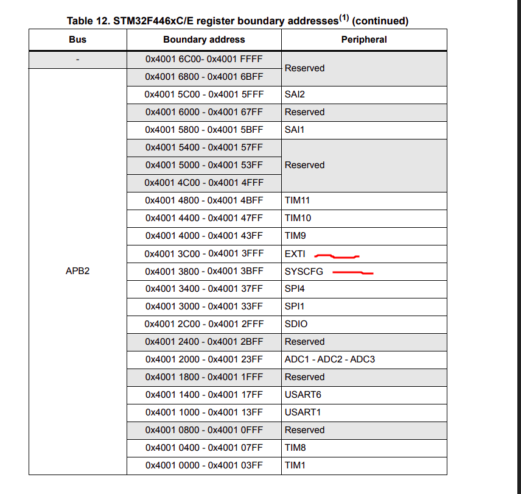

here one needs the SYSCFG peripheral, and EXTI 
Instead of creating your own peripheral this time
use mcu's CMSIS library to be able to access your mcus NVICs fucntion
It can be found by creating a seperate New project with Stm32Cube IDE

the build the new project and copy and paste (DON'T MOVE rather copy and paste) that entire CMSIS library
into your empty project 

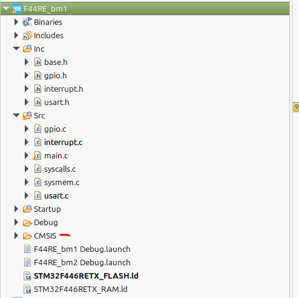

you will see this error

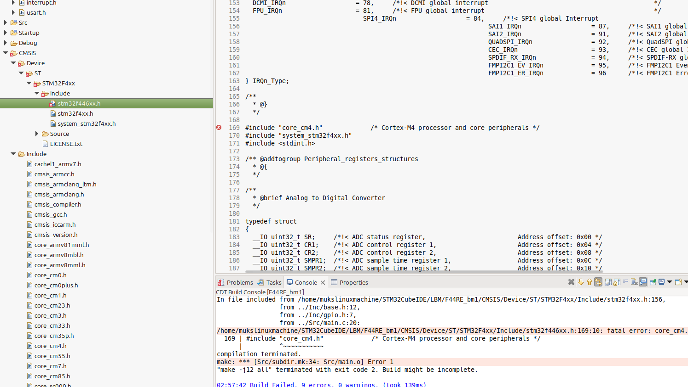

to get rid of this simply copy the file path of the core_cm#.h you need

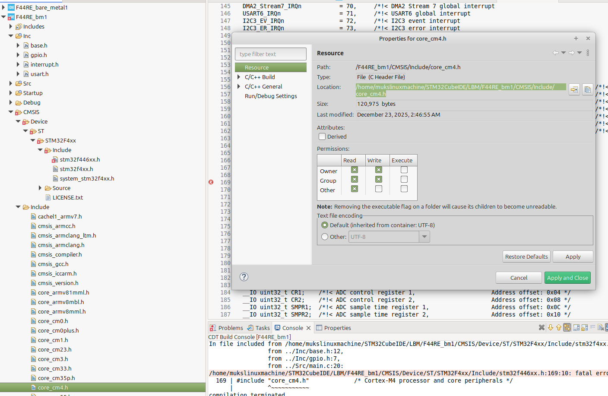

and Right click project → Properties → C/C++ Build → Settings → Tool Settings → MCU GCC Compiler → Includes

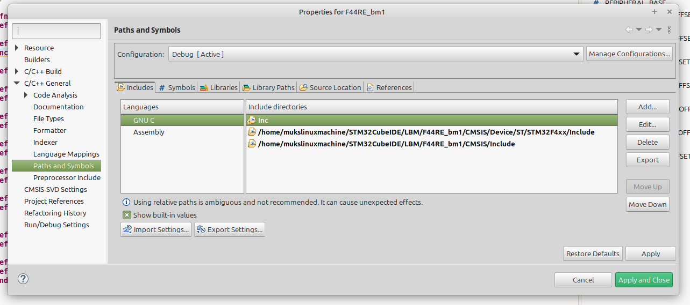

/CMSIS/Include
/CMSIS/Device/ST/STM32F4xx/Include      are two paths you need to make the CMSIS library visable to the compiler 

then define your your mcu type, and include the its header in the base header

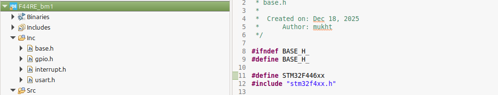

you can access all the mcu registers in the CMSIS library, mainly the interrupts 

to initialize intterupts, you first enable clock access to the  SYSCFG bus peripherial

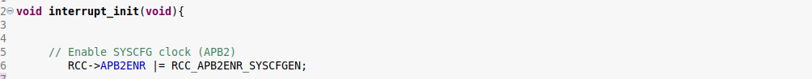

then  set the GPIO to be used as an input ( already done )  

in the syscfg EXTI registers, find the pin to be use( mine is pc13 ) so EXTI 13 

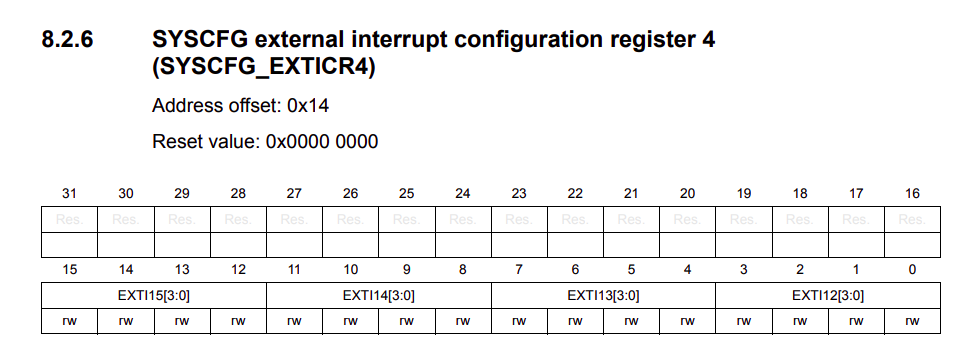

now set the EXTI to the appropriate GPIO port 

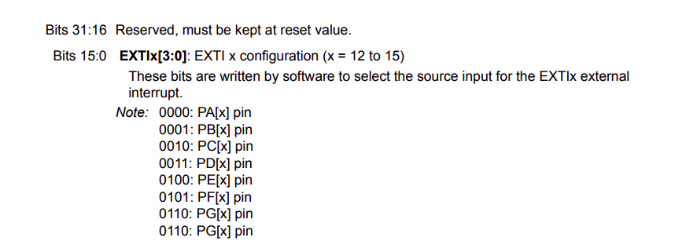

I'm using GPIOC port so 

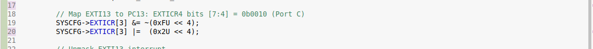

then we unmask the pin we want to use 

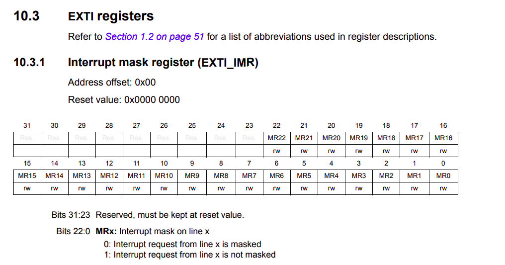

now we set the interrupt to a rising or falling egde depending on your application, mine would be a falling egde 
 ( view the registers definiton below the Event mask register ) 

then we clear the flag in the pending register 

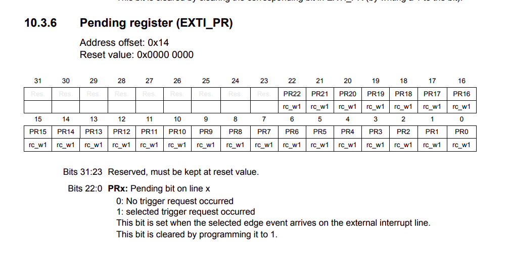

then we disable the IRQ, clear any pending flags, set the priorty of the intterupt, then enable it 
enable IRQ

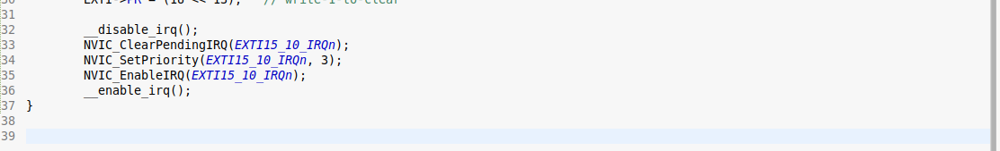

Lastly you call your IRQ handler function depending on the EXTI you are using in your stm32F446xx.h or mcu header

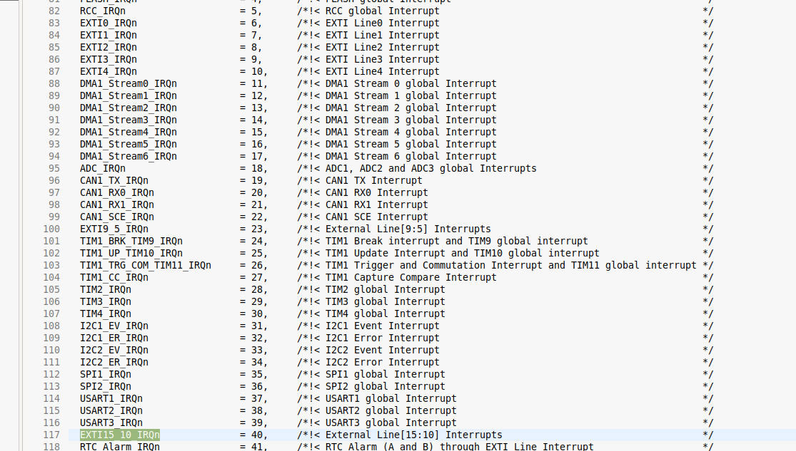

from there you define your action and clear the pending register again 

 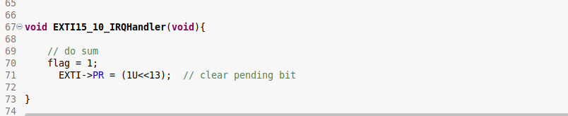

in the main funciton, enable SysTick function to tick every ms to check for debouncing from the CMSIS library
to tick every milisecond

SysTick_Config(SystemCoreClock / 1000); 

( debouncing is setting a small time interval so the state of the button press can settle ~ 30ms )

then create a variable to increment the function 

 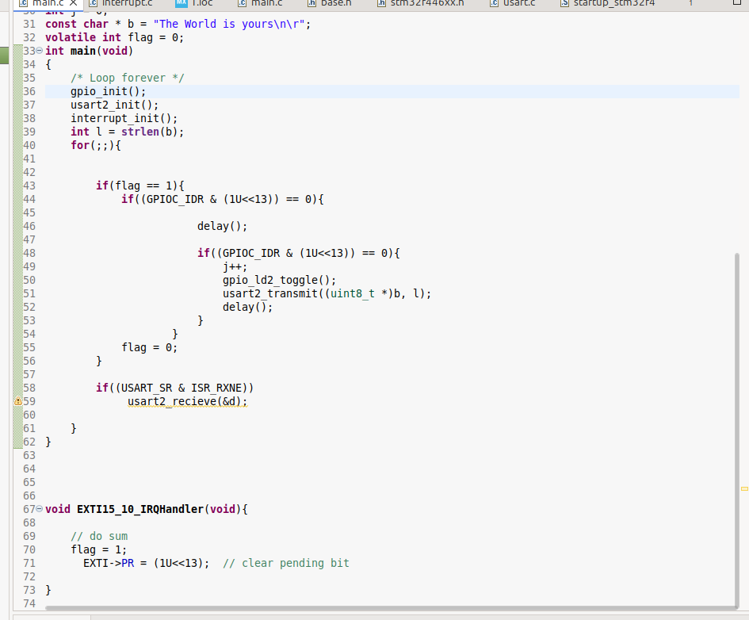

here is my main function 

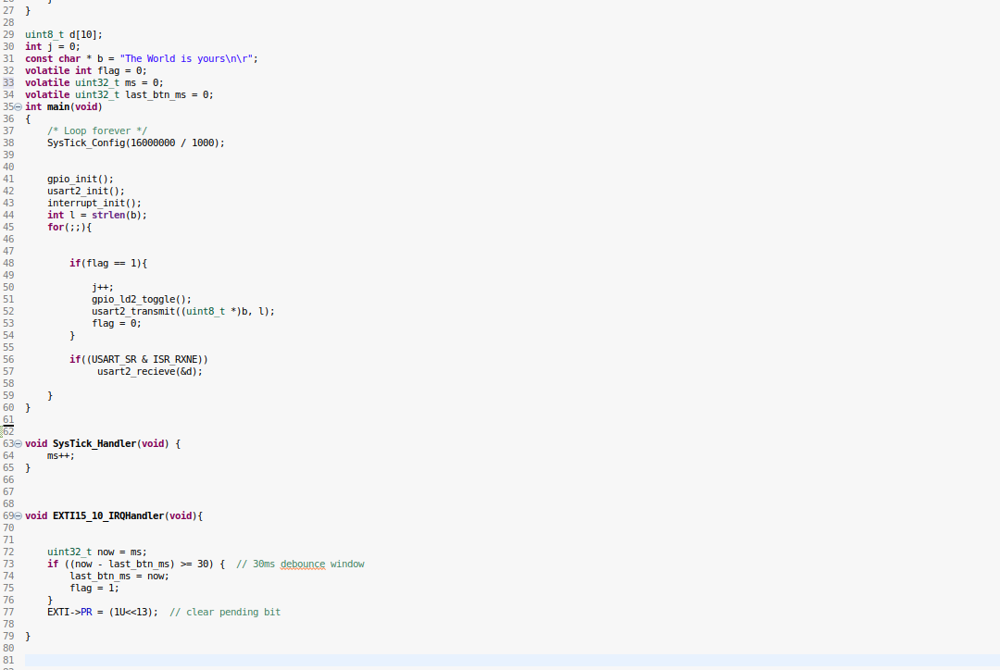

here I test it 

